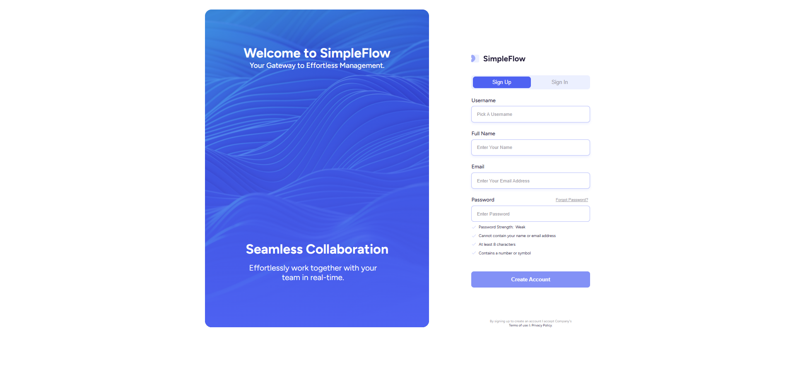

# SimpleFlow - User Authentication Platform

A contemporary web-based application designed for user sign-up and sign-in processes, developed using HTML, CSS, and JavaScript. This platform offers a user-friendly experience with instant form validation and adaptive layout.


## Key Capabilities

- **Account Creation**: Robust registration form featuring detailed input checks
- **Password Security Meter**: Instant evaluation of password robustness
- **Input Verification**: Browser-based checks with informative feedback
- **Adaptive Layout**: Optimized for both desktop and mobile environments
- **Contemporary Interface**: Elegant design incorporating fluid transitions
- **Data Persistence**: Utilizes browser storage for user information
- **Mobile App Compatible**: Features manifest and icons for app installation

## Online Demonstration

Experience the deployed application on GitHub Pages:  
**[Live Demo Link](https://maryamyazdani84.github.io/SimpleFlow)**

## Visual Previews



## Development Stack

- **HTML5**: Structured and semantic web markup
- **CSS3**: Advanced styling techniques with variables and layout systems
- **JavaScript**: Dynamic interactions and form management
- **Web Fonts**: Custom typography from Google Fonts

## System Requirements

- Compatible web browser (Chrome, Firefox, Safari, Edge recommended)
- No backend requirements - fully client-side operation

## Getting Started

1. **Download the Project:**
   ```bash
   git clone https://github.com/maryamyazdani84/simpleflow.git
   cd simpleflow
   ```

2. **Launch in Browser:**
   - Open the `index.html` file directly in your browser

## How to Use

### Creating an Account
1. Select the "Sign Up" option
2. Enter your desired username, complete name, email address, and secure password
3. Monitor the password strength display for security guidance
4. Press "Create Account" to complete registration

### Password Guidelines
- At least 8 characters required
- Include one number or special character
- Avoid using your name or email in the password
- Strength categories: Weak, Medium, Strong

## File Organization

```
SimpleFlow/
├── index.html                 # Primary HTML document
├── README.md                  # Documentation
└── assets/
    ├── css/
    │   └── styles.css         # Primary styles
    ├── images/                # Visual assets
    │   ├── logo.svg           # Brand logo
    └── js/
        └── script.js          # Interactive scripts
```

## Licensing Information

This project operates under the MIT License. Refer to the [LICENSE](LICENSE) file for complete terms.


